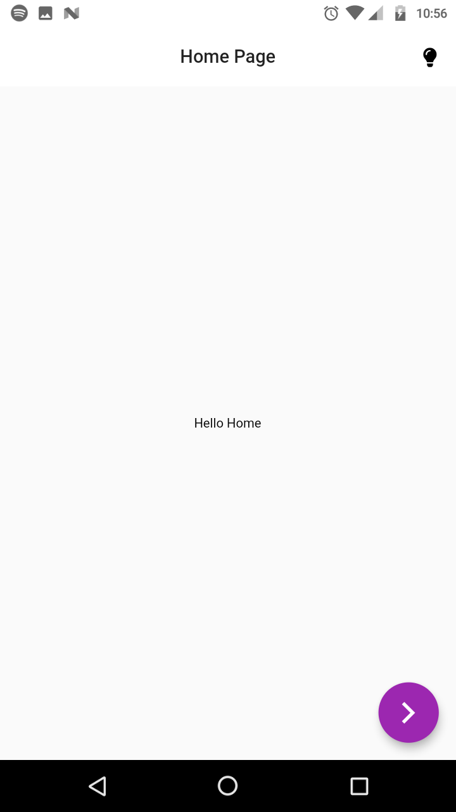
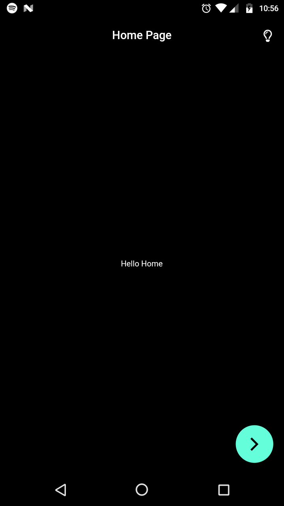

# Dark-Theme-Flutter

Flutter implementations of the popular state management packages and their template applications for `DARK THEME`.

## Packages used

  * [Flutter_BloC](https://pub.dev/packages/flutter_bloc)
  * [Provider](https://pub.dev/packages/provider)
  * [Scoped Model](https://pub.dev/packages/scoped_model)

## Inspiration

Pawan Kumar's [DevFest Application](https://www.youtube.com/playlist?list=PLR2qQy0Zxs_Vju3tKnYgzbAhywHHPuDjQ), where he used *Flutter BloC*. 

His source code is open sourced as well, go [here](https://github.com/iampawan/DevfestTutorialApp/tree/dev%23ch2) to send him some love. 

[Pawan Kumar](https://twitter.com/imthepk)

### Usage

  * Clone the repository

  * Choose an implementation (BloC/ Provider/ Scoped Model)

  * Hit `flutter run` in the terminal.

  * In the top right corner press the `light bulb` :bulb: to change the theme of the application.

    |

  * All you need is a `bool` to do this, meh!

  * Not just yet, go ahead and clean the cache, the app still gets rendered in its theme specified.

### Where do I code?

All you need to do is, modify `home_page.dart` and `another_page.dart` according to your needs (or write your own pages and keep it inside the `pages` folder).

The two sample pages are well commented for the purpose of the application.

### Getting Started with Dark Mode and State Management

Implementing `DARK MODE` is one of the ways of using state management in Flutter. You can read more about it [here](https://flutter.dev/docs/development/data-and-backend/state-mgmt/intro).

### Contributions

Hoping to see a lot of contributions in the project. `Issues` are welcome too. Star :star: the Repository if it helped you.

And do not forget to tag us in [@ariG23498](https://twitter.com/ariG23498) and [@_royarg](https://twitter.com/_royarg) in Twitter with your applications made with this template.
